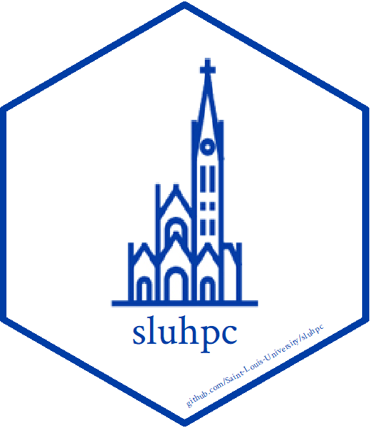

<!-- README.md is generated from README.Rmd. Please edit that file -->

# sluhpc 

<!-- badges: start -->

[](https://github.com/Saint-Louis-University/sluhpc)
[](https://github.com/Saint-Louis-University/sluhpc/commits/master)
[](https://travis-ci.org/Saint-Louis-University/sluhpc)
[](https://ci.appveyor.com/project/Saint-Louis-University/sluhpc)
[](https://codecov.io/gh/Saint-Louis-University/sluhpc?branch=master)
<!-- badges: end -->

## Overview

The goal of `sluhpc` is to simplify the
[parallelization](https://en.wikipedia.org/wiki/Parallel_computing) and
execution of
[R](https://en.wikipedia.org/wiki/R_\(programming_language\)) code on
the [Saint Louis University](https://www.slu.edu) (SLU) [High
Performance Cluster](https://apex.slu.edu) (HPC).

<br />

## Installation

You can install `sluhpc` from
[GitHub](https://github.com/Saint-Louis-University/sluhpc) with:

``` r
remotes::install_github("Saint-Louis-University/sluhpc")
```

<br />

## Notes

### R Version

The current version of R on the cluster is [Microsoft R
Open](https://mran.microsoft.com/open) 3.3.2. You may avoid many
potential errors by working in a local copy of R circa 3.3.2.

### IP Restriction

The cluster only accepts connections from [IP
addresses](https://en.wikipedia.org/wiki/IP_address) registered to SLU.
If working off campus, you will need to log into the
[VPN](https://vpn.slu.edu/+CSCOE+/logon.html) using your SLU Net ID and
password.

<br />

## Example

This is a three-step example which shows how to execute R code in
parallel on the cluster.

### Step 1

We define a function and construct a corresponding parameter set. Then
we create a local folder containing of all the files necessary to run
the code in parallel on the cluster.

``` r
library(sluhpc)

my_function <- function(parameter_mu, parameter_sd) {
  sample <- rnorm(10^6, parameter_mu, parameter_sd)
  c(sample_mu = mean(sample), sample_sd = sd(sample))
}

my_parameters <- data.frame(parameter_mu = 1:10,
                            parameter_sd = seq(0.1, 1, length.out = 10))

slurm_job <- slurm_apply(my_function, 
                         my_parameters, 
                         "my_apply")
```

### Step 2

We open a [secure shell](https://en.wikipedia.org/wiki/Secure_Shell)
(SSH) connection to the cluster using credentials stored in your
.Renviron file, upload the previously created local folder, and submit
the job to the [Slurm Workload
Manager](https://en.wikipedia.org/wiki/Slurm_Workload_Manager).

``` r
session <- apex_connect()
slurm_upload(session, slurm_job)
slurm_submit(session, slurm_job)
```

### Step 3

When the job is complete, we can download the output files into our
local folder, row bind the results together, and disconnect our SSH
session.

``` r
while(slurm_is_running(session, slurm_job)) { Sys.sleep(5) }
slurm_download(session, slurm_job)
results <- slurm_output_dfr(slurm_job)
apex_disconnect(session)
```

<br />

## About

### Saint Louis University 

Founded in 1818, [Saint Louis University](https://www.slu.edu) is one of
the nation’s oldest and most prestigious Catholic institutions. Rooted
in Jesuit values and its pioneering history as the first university west
of the Mississippi River, SLU offers nearly 13,000 students a rigorous,
transformative education of the whole person. At the core of the
University’s diverse community of scholars is SLU’s service-focused
mission, which challenges and prepares students to make the world a
better, more just place.
